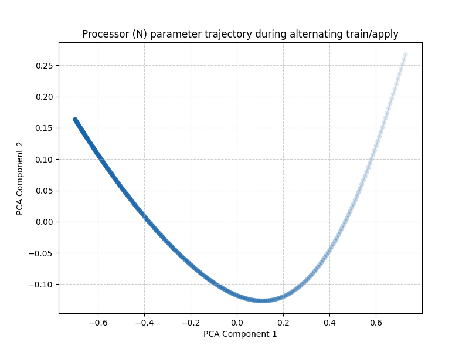
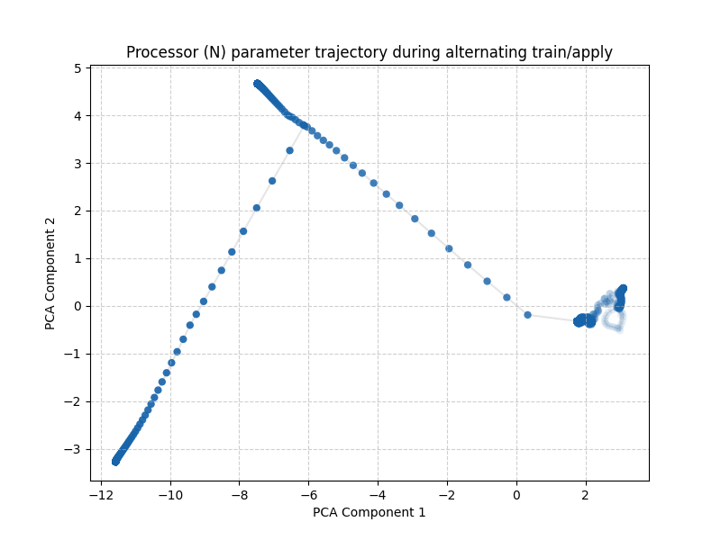

# Self Replication in Neural Networks

Unofficial code for some of the experiments of the paper "Self-Replication in Neural Networks" by Gabor et al. (Artificial Life, 2022) https://doi.org/10.1162/artl_a_00359

Short story short: I was curious about the paper, did not find the code, decided to write one in Jax.  
Not super-polished, yet.



## How to use

Pre-requisites: jax, optax, matplotlib, numpy, scikit-learn

Two main scripts, depending on what you want to do:
* quine.py --> use this for weightwise (self)-application N <- M or N <- N
* train_quine.py -> use this for weightwise (self)-training N <-w M or N <-w N (can alternate between a few steps of training and a few steps of application).

Each script produces a PCA plot of the parameters of the N network over time.

To run: python \[your script.py\] [args] 

The command-line arguments are only a few (`python script.py --help` to list them).  
Inspecting the script requires a few minutes.

## Examples
* Perform self-application (`--self_replicate`) for 200 steps without adding noise to the resulting parameters. Every 50 steps update the network's parameter with the currently generated parameters.  

```bash
python quine.py --weightwise_iterations 200 --hidden_size 20 --self_replicate --regenerate_every 50 --noise 0
```

Warning: this run sometimes results in NaN values in the parameters (in line with the original paper). The script will stop and plot the PCA up to that step. Use the `--seed` if you want to use a fixed seed.

* Train a single network (`--self_train`) to become a fixed point: 1 training cycle with 200 training epochs and without any self application steps.  

```bash
python train_quine.py --cycles 1 --train_epochs_per_cycle 200 --apply_steps_per_cycle 0 --lr 1e-3 --hidden_size 20 --self_train
```

You can get unexpected results. For example:
```bash
python train_quine.py --cycles 10 --train_epochs_per_cycle 500 --apply_steps_per_cycle 3 --lr 1e-1 --hidden_size 8 --self_train
```
results in the following trajectory, where the apply steps cause the jump in the parameter space as the training did not converge to a high-order quine.




